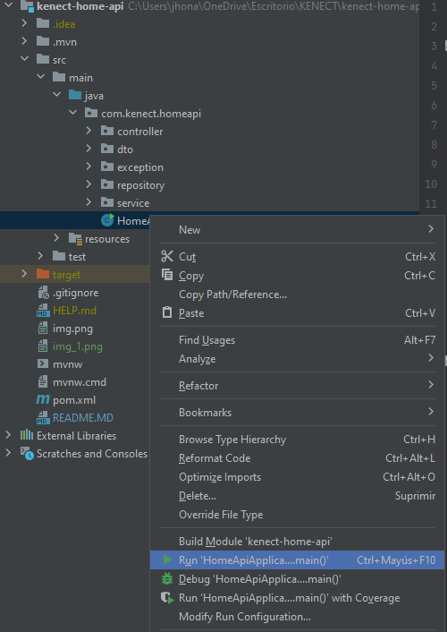
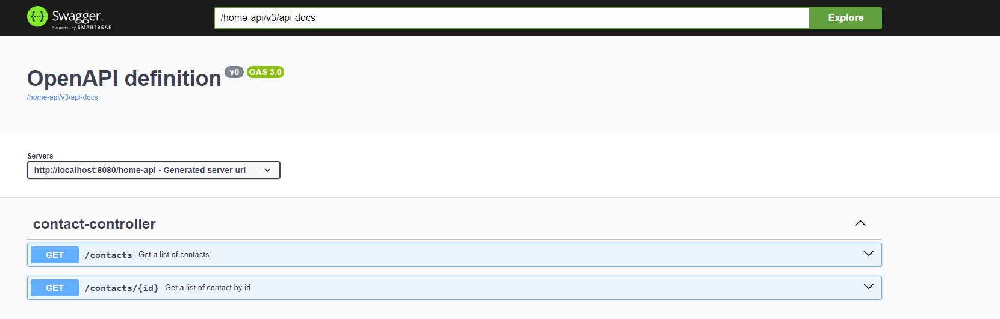

# Home-API Kenect


# Install Dependencies

 - mvn clean install -U

# Start the application

On the HomeApiApplication file,  right click and then run application.



# Swagger Documentation

http://localhost:8080/home-api/swagger-ui/index.html#/


# Postman

To test the API we can use Postman.

- GET
- Url: http://localhost:8080/home-api/contacts
```json response
{
  "content": [
    "contacts": [
                    {
                        "id": 1,
                        "name": "jmadsen",
                        "email": "jmadsen@kenect.com",
                        "created_at": "2020-06-25T02:29:23.755Z",
                        "updated_at": "2020-06-25T02:29:23.755Z"
                    },
                    {
                        "id": 4,
                        "name": "Jalisa Quigley",
                        "email": "clotilde.corkery@example.com",
                        "created_at": "2020-06-25T02:31:51.233Z",
                        "updated_at": "2020-06-25T02:31:51.233Z"
                    },
                ]
             ]
}
```

- GET
- Url : http://localhost:8080/home-api/contacts/1
```json response
{
    "contact": {
        "id": 1,
        "name": "jmadsen",
        "email": "jmadsen@kenect.com",
        "created_at": "2020-06-25T02:29:23.755Z",
        "updated_at": "2020-06-25T02:29:23.755Z"
    }
}